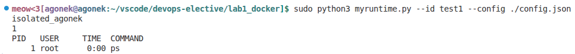

# Лабораторная работа 1: Docker

## 1. Задание

### 1.1 Общее описание

Разработайте утилиту на любом удобном языке программирования (например, Go, Python), которая запускает команду в контейнере.

### 1.2 OCI

Должна конфигурироваться `config.json` по спецификации OCI

### 1.3 Namespaces

Для каждого контейнера при его запуске должны создаваться новые namespaces:
- PID namespace;
- Mount namespace;
- UTS namespace, внутри которого `hostname` устанавливается в значение из поля `hostname` конфига.

### 1.4 Директория контейнера

Для каждого контейнера с идентификатором `<id>` должна создаваться директория:

```bash
/var/lib/{имя-вашей-утилиты}/{id}
```

### 1.5 Rootfs и overlayfs

В качестве rootfs использовать Alpine, но `chroot` делать на overlayfs:

```bash
lowerdir=<базовый rootfs Alpine>
upperdir=/var/lib/{имя-утилиты}/{id}/upper
workdir=/var/lib/{имя-утилиты}/{id}/work
merged=/var/lib/{имя-утилиты}/{id}/merged
```

### 1.6 Процесс запуска

Запускаемая команда становится `PID=1` внутри контейнера и утилита ждёт её завершения (foreground)

### 1.7 Опционально

1) Настроить cgroups для ограничения ресурсов контейнера (CPU, память, IO).
2) Внутри контейнера монтировать `/proc` для корректной работы утилит типа `ps`.


## 2. Ход выполнения

### 2.0 Alpine rootfs

Базовый alpine rootfs был скачан в виде архива [отсюда](https://dl-cdn.alpinelinux.org/alpine/latest-stable/releases/x86_64/) и распакован в папку лабораторной. Используемый архив - `alpine-minirootfs-3.23.3-x86_64.tar.gz`.

### 2.1 OCI - Open Container Runtime - спецификация

Пример представлен тут: [https://github.com/opencontainers/runtime-spec/blob/main/config.md](https://github.com/opencontainers/runtime-spec/blob/main/config.md)

В нашем случае будет использоваться такой `config.json`:
```json
{
    "ociVersion": "1.3.0",
    "process": {
        "cwd": "/root",
        "args": [
            "/bin/sh",
            "-c",
            "hostname && echo $$ && ps"
        ]
    },
    "root": {
        "path": "alpine-rootfs",
        "readonly": true
    },
    "hostname": "isolated_agonek",
    "linux": {
        "namespaces": [
            {
                "type": "pid"
            },
            {
                "type": "mount"
            },
            {
                "type": "uts"
            }
        ]
    }
}
```

По умолчанию в качестве запускаемой команды будет использоваться вызов `hostname` для показа имени хоста, `echo $$` для вывода PID текущего процесса, а также вызов утилиты `ps`.

# 2.2 Описание утилиты

Утилита была разработана с помощью Python, весь код представлен в файле `myruntime.py`. Утилита представляет собой набор функций, необходимых для выполнения всей лабораторной. Подробные комментарии позволят понять логику исполнения кода, но я всё равно кратко пробегусь по основному функционалу:

- **Для каждого контейнера при его запуске должны создаваться новые namespaces (PID, Mount, UTS):**
  - `create_pid_namespace()` — создает PID namespace через `os.unshare(os.CLONE_NEWPID)` и форкает дочерний процесс
  - `create_mount_namespace()` — создает mount namespace через `os.unshare(os.CLONE_NEWNS)` и изолирует монтирование
  - `create_uts_namespace()` — создает UTS namespace через `os.unshare(os.CLONE_NEWUTS)` и устанавливает `hostname` через `socket.sethostname()`

- **Для каждого контейнера с идентификатором <id> должна создаваться директория /var/lib/{имя-утилиты}/{id}:**
  - `build_paths()` — формирует пути для overlay слоев (upperdir, workdir, merged)
  - `create_container_dirs()` — создает сформированные директории для определенного контейнера (в моем случае, например, `test1`)

- **В качестве rootfs использовать Alpine, но `chroot` делать на overlayfs:**
  - `mount_overlay()` — монтирует overlayfs с lowerdir, upperdir, workdir на merged
  - `enter_rootfs()` — выполняет chroot в merged директорию

- **Запускаемая команда становится PID=1 и утилита ждет её завершения (foreground):**
  - `run_process()` — запускает процесс через `os.execvp()`, заменяя текущий процесс на дочерний
  - родительский процесс ожидает заверешния дочернего с помощью `os.waitpid(child_pid, 0)`

# 2.3 Опциональные пункты

Я настроила cgroups для ограничений по ram, а также смонтировала `/proc`.

Функции, реализованные для этого:
- **Настроить cgroups для ограничения ресурсов контейнера (CPU, память, IO):**
Реализовано ограничение памяти через cgroups v2.
  - `create_ram_cgroup()` — создает cgroup `/sys/fs/cgroup/myruntime/<id>`, включает `memory controller` и задает лимит памяти через файл `memory.max`. После запуска дочернего процесса его PID записывается в `cgroup.procs`, за счет чего ограничение и применяется к контейнеру.
  - `clean_up_cgroup()` — удаляет cgroup директорию после завершения контейнера

- **Внутри контейнера монтировать /proc для корректной работы утилит типа ps:**
  - `mount_proc()` — монтирует `/proc` внутри контейнера, если еще не смонтирован
  - `is_mounted()` — проверяет, смонтирован ли путь, для избежания дублирования

## 3. Проверка результата

### 3.1 Проверка основного функционала и `/proc`
Запустим команду:

```bash
sudo python3 myruntime.py run --id test1 --config ./config.json
```

Получим:


`hostname` принял значение из нашего конфига, PID процесса = 1, `ps` работает.

### 3.2 Проверка cgroups для ram

Для проверки заменим команду процесса в `config.json` на `/bin/sh` для того, чтобы процесс не завершался, пока мы этого не захотим. Запустим команду из п.3.1 и в соседнем терминале проверим директорию, отвечающую за жесткий лимит памяти сверху, и директорию, содержащую PID дочернего процесса, который как раз в cgroup и находится:

```bash
sudo cat /sys/fs/cgroup/myruntime/test1/memory.max
sudo cat /sys/fs/cgroup/myruntime/test1/cgroup.procs
```

Получим следующее:


## 4. Полезные ссылки
- [https://github.com/opencontainers/runtime-spec/blob/main/config.md](https://github.com/opencontainers/runtime-spec/blob/main/config.md)
- [https://github.com/opencontainers/runtime-spec/blob/main/config-linux.md](https://github.com/opencontainers/runtime-spec/blob/main/config-linux.md)
- [https://docs.kernel.org/admin-guide/cgroup-v2.html](https://docs.kernel.org/admin-guide/cgroup-v2.html)
